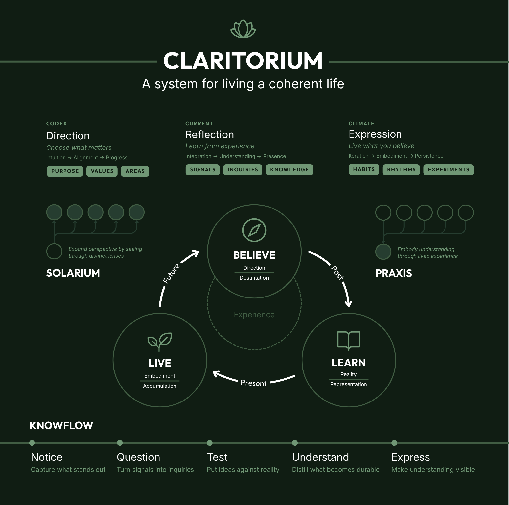

# Claritorium

Claritorium is a framework for cultivating coherence between what we believe, how we live, and what we learn.

**Believe → Live → Learn ↻**

- **Believe** — Establish meaningful Direction.
- **Live** — Put belief into contact with present reality.
- **Learn** — Integrate what reality teaches.

**Coherence is cultivated, not completed.**

The diagram shows the architecture as a living whole: three movements held within the conditions of clarity, with related Systems that develop understanding, embodiment, perspective, and value. These relationships are complementary, not a five-step pipeline.

## Core Movements

**Direction → Reflection → Expression**

- **Direction** — Choose what matters.
- **Reflection** — Learn from experience.
- **Expression** — Live what you believe.

These are movements through the Claritorium. In practice, they can be represented simply:

| Direction | Reflection | Expression |
| --- | --- | --- |
| Purpose | Signals | Habits |
| Values | Inquiries | Rhythms |
| Areas | Knowledge | Experiments |

### Direction

Direction establishes what guides:

**Purpose → Values → Principles → Areas → Themes**

Purpose provides a heading. Values identify what is worth protecting and embodying. Principles support judgment. Areas name what deserves ongoing care. Themes give a season emphasis without turning it into a fixed destination.

Five Life Areas offer a balanced starting frame:

- **Craft** — Create meaningful work.
- **Constitution** — Cultivate strength and vitality.
- **Community** — Build deep relationships.
- **Contemplation** — Pursue wisdom and understanding.
- **Celebration** — Experience joy and wonder.

### Reflection

Reflection turns attention and experience into understanding:

**Signals → Inquiries → Knowledge**

- **Signals** capture meaningful observations, tensions, surprises, curiosities, and recurring experiences.
- **Inquiries** turn meaningful Signals into active questions worth exploring.
- **Knowledge** preserves what has become durable enough to keep.

Knowledge can develop through:

**Pattern → Model → System**

- **Pattern** — A recurring relationship that transfers across contexts.
- **Model** — A higher-order structure that organizes and explains related Patterns.
- **System** — An integrated body of philosophy, structure, and practice.

Works sit beside this tree as articulated output: writing, teaching, publishing, and creation.

### Expression

Expression turns belief and understanding into lived reality through Habits, Rhythms, and Experiments.

**Experiment = a bounded test used to learn.**

**Practice = sustained embodiment of something worth living.**

Experiments generate learning. Practice generates transformation. A repeated behavior is not automatically a Practice; Practice is defined by what it embodies.

## The Five Systems

- [Claritorium](systems/claritorium.md) — **Cultivate clarity.** The coherent frame.
- [KnowFlow](systems/knowflow.md) — **Develop understanding.** The learning System.
- [Praxis](systems/praxis.md) — **Embody understanding.** The embodiment System.
- [Solarium](systems/solarium.md) — **Expand perspective.** The perspective System.
- [Equilio](systems/equilio.md) — **Create value.** The product thinking System.

Claritorium provides the coherent frame. KnowFlow develops understanding across the architecture. Solarium broadens the perspectives through which understanding develops. Praxis turns understanding into lived experience. Equilio demonstrates how the philosophy can be applied within product work.

The Systems reinforce one another, but they do not map one-to-one onto Direction, Reflection, and Expression.

## Begin Simply

Claritorium is intentionally tool-independent. It can live in Markdown, Notion, Obsidian, plain documents, notebooks, paper, or another medium. The architecture matters more than the software.

A useful way to begin is to:

1. Clarify Direction.
2. Capture Signals.
3. Develop a small number of meaningful Inquiries.
4. Preserve durable Knowledge.
5. Use Experiments when understanding needs contact with reality.
6. Turn worthwhile understanding into Practice and Rhythm.

This is an orientation, not a rigid workflow. Claritorium should support life rather than make life conform to a system.

The portable templates for [Signals](templates/signal.md), [Inquiries](templates/inquiry.md), [Experiments](templates/experiment.md), [Patterns](templates/pattern.md), and [Practices](templates/practice.md) offer small starting points.

**Notion develops the architecture. GitHub publishes the durable architecture.**
